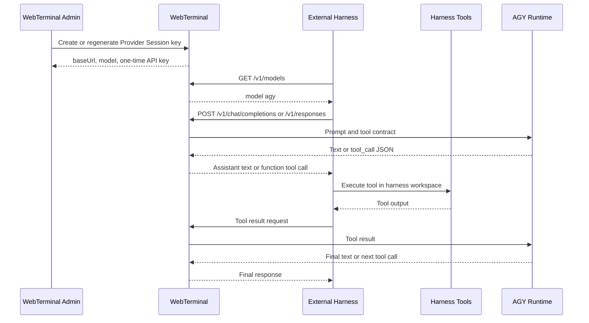

# WebTerminal OpenAI-Compatible Provider Harness Spec

Status: implemented contract draft  
Audience: external agent harness developers  
Model ID: `agy`  
Base path: `/v1`

## Summary

WebTerminal can expose one AGY Provider Session as an OpenAI-compatible model provider. The external harness calls WebTerminal with an API key, receives assistant text or function tool calls, executes tools in its own workspace, and sends tool results back to WebTerminal.

WebTerminal does not execute external harness tools in Provider Mode.



## Session Provisioning

Provider sessions are created by an authenticated WebTerminal admin.

```http
POST /api/agent/provider-sessions
Content-Type: application/json
Cookie: <admin session>

{
  "profile": "agy-default",
  "displayName": "External Coding Session"
}
```

Successful response includes a plaintext `apiKey`. This key is shown only at creation or regeneration time.

```json
{
  "sessionId": "00000000-0000-0000-0000-000000000000",
  "state": "Ready",
  "baseUrl": "https://host.example/v1",
  "model": "agy",
  "apiKey": "wta_...",
  "harness": {
    "baseUrl": "https://host.example/v1",
    "model": "agy",
    "authorization": "Bearer wta_...",
    "environment": {
      "OPENAI_BASE_URL": "https://host.example/v1",
      "OPENAI_API_KEY": "wta_...",
      "OPENAI_MODEL": "agy",
      "WEBTERMINAL_PROVIDER_BASE_URL": "https://host.example/v1",
      "WEBTERMINAL_PROVIDER_API_KEY": "wta_..."
    }
  },
  "connectionManifest": {
    "version": "webterminal-agent-provider.v1",
    "model": "agy",
    "baseUrl": "https://host.example/v1"
  },
  "expiresAt": "2026-07-20T12:00:00+00:00"
}
```

### API Key Regeneration

Admins can regenerate a provider session key.

```http
POST /api/agent/provider-sessions/{sessionId}/api-key/regenerate
Cookie: <admin session>
```

The response contains a new plaintext `apiKey` and `oneTimeDisplay: true`. The old key is revoked immediately.

Session detail and list endpoints never return an existing plaintext key. They return `<apiKey>` placeholders in manifest fields.

## Harness Configuration

Use the values from the session creation or key regeneration response.

```powershell
$env:OPENAI_BASE_URL = "https://host.example/v1"
$env:OPENAI_API_KEY = "wta_..."
$env:OPENAI_MODEL = "agy"
```

For clients that use WebTerminal-specific names:

```powershell
$env:WEBTERMINAL_PROVIDER_BASE_URL = "https://host.example/v1"
$env:WEBTERMINAL_PROVIDER_API_KEY = "wta_..."
```

All provider API requests require:

```http
Authorization: Bearer <provider-session-api-key>
Content-Type: application/json
```

Use `Idempotency-Key` for retryable generation requests. Reusing the same key within one provider session is rejected as a duplicate.

```http
Idempotency-Key: 2a47c8b0-6394-46e8-9f3d-3f3f8684ef1d
```

## Supported Endpoints

| Method | Path | Purpose |
| --- | --- | --- |
| `GET` | `/v1/models` | Verify key and discover the `agy` model. |
| `POST` | `/v1/chat/completions` | Chat Completions-compatible generation. |
| `POST` | `/v1/responses` | Responses-compatible generation. |

Unsupported `/v1/*` endpoints return `400 invalid_request_error`.

## GET /v1/models

```bash
curl "$OPENAI_BASE_URL/models" \
  -H "Authorization: Bearer $OPENAI_API_KEY"
```

Response:

```json
{
  "object": "list",
  "data": [
    {
      "id": "agy",
      "object": "model",
      "created": 1784563200,
      "owned_by": "webterminal"
    }
  ]
}
```

## POST /v1/chat/completions

### Text Request

```bash
curl "$OPENAI_BASE_URL/chat/completions" \
  -H "Authorization: Bearer $OPENAI_API_KEY" \
  -H "Content-Type: application/json" \
  -H "Idempotency-Key: $(uuidgen)" \
  -d '{
    "model": "agy",
    "messages": [
      { "role": "user", "content": "Summarize this repository." }
    ]
  }'
```

Response:

```json
{
  "id": "chatcmpl_...",
  "object": "chat.completion",
  "created": 1784563200,
  "model": "agy",
  "choices": [
    {
      "index": 0,
      "message": {
        "role": "assistant",
        "content": "..."
      },
      "finish_reason": "stop"
    }
  ],
  "usage": {
    "prompt_tokens": 0,
    "completion_tokens": 0,
    "total_tokens": 0
  }
}
```

### Tool Request

The harness may send OpenAI-style function tools. If AGY decides a tool is needed, WebTerminal returns `finish_reason: "tool_calls"`.

```json
{
  "model": "agy",
  "messages": [
    { "role": "user", "content": "Read package metadata." }
  ],
  "tools": [
    {
      "type": "function",
      "function": {
        "name": "read_file",
        "description": "Read a file from the harness workspace.",
        "parameters": {
          "type": "object",
          "properties": {
            "path": { "type": "string" }
          },
          "required": ["path"]
        }
      }
    }
  ]
}
```

Tool call response:

```json
{
  "choices": [
    {
      "index": 0,
      "message": {
        "role": "assistant",
        "content": null,
        "tool_calls": [
          {
            "id": "call_abc",
            "type": "function",
            "function": {
              "name": "read_file",
              "arguments": "{\"path\":\"package.json\"}"
            }
          }
        ]
      },
      "finish_reason": "tool_calls"
    }
  ]
}
```

The harness must execute the tool locally and send all pending tool results back:

```json
{
  "model": "agy",
  "messages": [
    { "role": "user", "content": "Read package metadata." },
    {
      "role": "assistant",
      "content": null,
      "tool_calls": [
        {
          "id": "call_abc",
          "type": "function",
          "function": {
            "name": "read_file",
            "arguments": "{\"path\":\"package.json\"}"
          }
        }
      ]
    },
    {
      "role": "tool",
      "tool_call_id": "call_abc",
      "name": "read_file",
      "content": "{\"name\":\"example\"}"
    }
  ]
}
```

Rules:

- The final message must be the new `user` message or a `tool` result.
- Tool result IDs must match pending tool call IDs.
- Duplicate or unknown `tool_call_id` values return `400 invalid_request_error`.
- If multiple tool calls are pending, submit all matching tool messages after the assistant tool-call message.
- While waiting for tool results, new non-tool generation requests return `409`.

### Chat Streaming

Set `stream: true`. The response is `text/event-stream` with OpenAI-style `chat.completion.chunk` payloads and ends with:

```text
data: [DONE]
```

For tool calls, streaming chunks include `delta.tool_calls` and finish with `finish_reason: "tool_calls"`.

## POST /v1/responses

### Text Request

```bash
curl "$OPENAI_BASE_URL/responses" \
  -H "Authorization: Bearer $OPENAI_API_KEY" \
  -H "Content-Type: application/json" \
  -H "Idempotency-Key: $(uuidgen)" \
  -d '{
    "model": "agy",
    "input": "Explain how to run the tests."
  }'
```

Response:

```json
{
  "id": "resp_...",
  "object": "response",
  "created_at": 1784563200,
  "model": "agy",
  "status": "completed",
  "output": [
    {
      "id": "item_...",
      "object": "response.output_item",
      "type": "message",
      "role": "assistant",
      "content": [
        { "type": "text", "text": "..." }
      ]
    }
  ],
  "usage": {
    "total_tokens": 0,
    "input_tokens": 0,
    "output_tokens": 0
  }
}
```

### Responses Tool Result

If the response status is `requires_action`, execute the returned function call in the harness workspace and send a `function_call_output`.

```json
{
  "model": "agy",
  "previous_response_id": "resp_...",
  "input": [
    {
      "type": "function_call_output",
      "call_id": "call_abc",
      "output": "{\"ok\":true}"
    }
  ]
}
```

Rules:

- `previous_response_id`, when provided, must match the last response ID for the provider session.
- `function_call_output.call_id` must match the pending call ID.
- One pending Responses tool result is accepted at a time.

### Responses Streaming

Set `stream: true`. The response is `text/event-stream`. Text streams emit events such as:

- `response.created`
- `response.in_progress`
- `response.output_item.added`
- `response.content_part.added`
- `response.text.delta`
- `response.content_part.done`
- `response.output_item.done`
- `response.done`

Function-call streams emit:

- `response.output_item.added`
- `response.function_call_arguments.delta`
- `response.function_call_arguments.done`
- `response.output_item.done`
- `response.done`

The stream ends with:

```text
data: [DONE]
```

## Supported Parameters

### Chat Completions

Accepted fields:

- `model`: must be `agy`
- `messages`: required, non-empty
- `stream`
- `tools`
- `tool_choice`
- `temperature`
- `max_tokens`
- `user`
- `metadata`
- `stop`
- `seed`
- `n`: only `1` or omitted
- `top_p`
- `presence_penalty`
- `frequency_penalty`
- `top_logprobs`
- `parallel_tool_calls`

Rejected fields:

- `logprobs: true`
- `response_format`
- `n > 1`

Accepted-but-best-effort fields may be parsed for compatibility but are not guaranteed to change AGY behavior.

### Responses

Accepted fields:

- `model`: must be `agy`
- `input`: required
- `instructions`
- `tools`
- `tool_choice`
- `parallel_tool_calls`
- `previous_response_id`
- `stream`
- `temperature`
- `max_output_tokens`
- `metadata`
- `user`

Accepted-but-best-effort fields may be parsed for compatibility but are not guaranteed to change AGY behavior.

## Session State And Concurrency

One Provider Session accepts one generation request at a time.

| State | Harness behavior |
| --- | --- |
| `Ready` | Normal requests are accepted. |
| `WaitingForRequest` | Normal requests are accepted. |
| `Generating` | Requests return `409 session_busy`. |
| `WaitingForToolResult` | Only matching tool-result requests are accepted. |
| `Failed` | Requests return `503 provider_unavailable`. |
| `Stopped` or expired | API key authentication fails. |

Provider sessions expire at `expiresAt`. After expiration or revoke, the API key no longer authenticates.

## Error Contract

Errors are JSON objects compatible with OpenAI-style error envelopes where possible.

```json
{
  "error": {
    "message": "Invalid provider API key.",
    "type": "invalid_api_key"
  }
}
```

| HTTP | Type | Cause |
| --- | --- | --- |
| `400` | `invalid_request_error` | Bad payload, unsupported model, unsupported endpoint, unknown tool call, unsupported parameter. |
| `401` | `invalid_api_key` | Missing, expired, revoked, or invalid provider key. |
| `403` | standard auth failure | Admin-only session management endpoint called without permission. |
| `409` | `provider_not_ready` | Session is not ready for that request type. |
| `409` | `session_busy` | Another request is already running or a tool result is required first. |
| `409` | `duplicate_request` | Duplicate `Idempotency-Key` for this provider session. |
| `429` | rate limit response | More than 60 provider API requests per minute per bearer key. |
| `503` | `provider_unavailable` or `provider_error` | AGY runtime failed or session entered `Failed`. |
| `504` | `provider_timeout` | AGY completion timed out. |

## Rate Limit And Timeout

- Rate limit: 60 requests per minute per provider API key.
- Queue limit: 0. Excess requests return `429`.
- Default generation timeout: 150 seconds.
- Harnesses should retry only idempotent requests and should use a fresh `Idempotency-Key` only when they intend a new generation.

## Security Requirements For Harnesses

- Treat `wta_...` keys as secrets.
- Store the key only in local secret storage or process environment.
- Do not log API keys, Authorization headers, prompts containing secrets, or tool outputs containing secrets.
- Execute tool calls only inside the harness-owned workspace.
- Validate tool names and arguments against the harness allowlist before execution.
- Never execute shell commands just because AGY asked for them unless the harness policy permits that tool.
- Assume WebTerminal will not protect the external workspace; the harness owns tool sandboxing and file permissions.

## Minimal Harness Loop

```pseudo
config = read WebTerminal connection manifest
messages = [{ role: "user", content: task }]

while true:
    response = POST config.baseUrl + "/chat/completions" with:
        model = "agy"
        messages = messages
        tools = harness_tool_schemas

    choice = response.choices[0]

    if choice.finish_reason == "stop":
        return choice.message.content

    if choice.finish_reason == "tool_calls":
        messages.append(choice.message)

        for call in choice.message.tool_calls:
            assert call.function.name in allowed_tools
            args = json_parse(call.function.arguments)
            output = execute_tool_in_harness_workspace(call.function.name, args)
            messages.append({
                role: "tool",
                tool_call_id: call.id,
                name: call.function.name,
                content: serialize(output)
            })

        continue

    fail("unsupported finish_reason")
```

## Compatibility Notes

This API is intentionally OpenAI-compatible, not a full OpenAI API implementation.

Current compatibility boundaries:

- Only model `agy` is supported.
- Embeddings, images, audio, files, assistants, batches, fine-tuning, and other `/v1/*` endpoints are unsupported.
- Usage token counts are currently placeholders set to `0`.
- Some sampling parameters are accepted for client compatibility but may not affect AGY runtime behavior.
- AGY must return tool calls in the WebTerminal-supported JSON format for reliable tool-call extraction.
- External system/developer-message priority is not equivalent to OpenAI hosted models; AGY session and project instructions remain authoritative.
