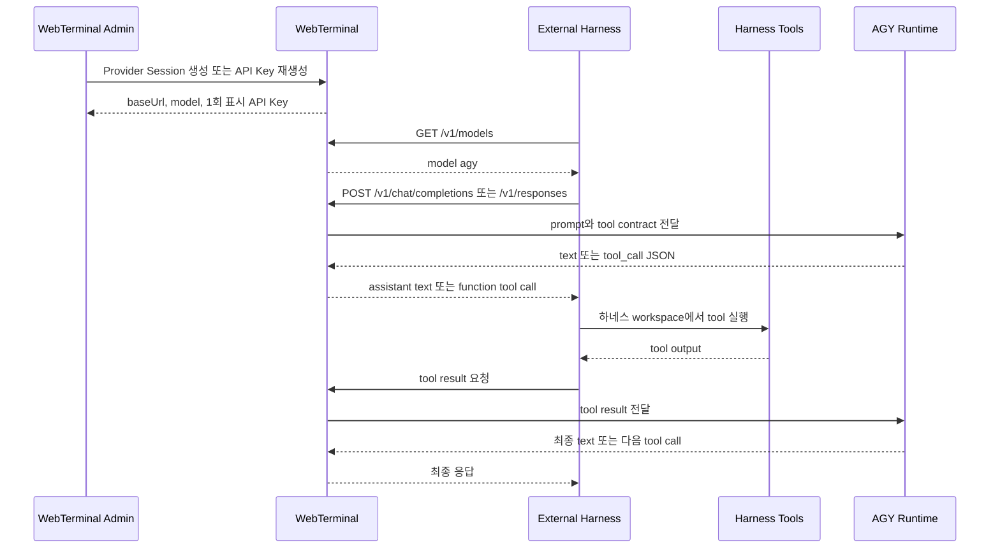

# WebTerminal OpenAI 호환 Provider Harness 명세

문서 상태: 구현 기준 명세 초안
대상 독자: 외부 Agent Harness 개발자, WebTerminal 운영자
모델 ID: `agy`
Base path: `/v1`
기본 공개 주소: `http://gpt.dotge.net:5255/v1`

## 요약

WebTerminal은 하나의 AGY Provider Session을 OpenAI 호환 모델 제공자로 노출할 수 있다. 외부 하네스는 WebTerminal에서 발급받은 API Key로 `/v1` API를 호출하고, WebTerminal은 AGY 응답을 OpenAI 형식의 assistant text 또는 function tool call로 돌려준다.

중요한 원칙은 다음과 같다.

- WebTerminal은 Provider Mode에서 외부 하네스의 tool을 직접 실행하지 않는다.
- 외부 하네스가 자기 컴퓨터와 자기 workspace에서 tool을 실행한다.
- WebTerminal은 AGY 입력, 응답 변환, tool call/result 매핑, session 상태 관리를 담당한다.
- API Key는 생성 또는 재생성 응답에서만 평문으로 표시된다.

현재 WebTerminal의 기본 HTTP 포트는 `5255`다. 따라서 외부 하네스의 기본 `OPENAI_BASE_URL`은 `http://gpt.dotge.net:5255/v1`이다. 만약 운영 환경에서 443/HTTPS reverse proxy를 앞단에 붙이면 해당 proxy 주소, 예를 들어 `https://gpt.dotge.net/v1`, 를 사용하면 된다.

## WebTerminal에서 API Mode 시작하기

관리자는 WebTerminal 터미널에서 API 서버 전용 세션을 직접 시작할 수 있다.

```powershell
apiServerStart
```

이 명령은 일반 PowerShell 명령으로 실행되지 않는다. WebTerminal 서버가 입력을 감지해서 현재 터미널 tab/session을 API Provider Session으로 전환한다. 성공하면 터미널에 다음 값이 1회 출력된다.

```text
OPENAI_BASE_URL=http://gpt.dotge.net:5255/v1
OPENAI_API_KEY=wta_...
OPENAI_MODEL=agy
```

그 다음 같은 터미널 세션에서 관리자가 `agy`를 실행한다.

```powershell
agy
```

이후 외부 하네스가 `/v1/chat/completions` 또는 `/v1/responses`로 보낸 입력은 새 AGY 프로세스를 만들지 않고, `apiServerStart`로 전환된 터미널 세션의 AGY stdin으로 전달된다. AGY 출력은 WebTerminal 서버가 받아 OpenAI 호환 응답으로 변환한다.

현재 1차 구현의 응답 경계는 terminal output idle/timeout 기반이다. 운영 안정화를 위해서는 AGY hook 또는 transcript 기반 completion boundary로 보강하는 것이 다음 단계다.



## Provider Session 발급

Provider Session은 WebTerminal 관리자만 생성할 수 있다.

```http
POST /api/agent/provider-sessions
Content-Type: application/json
Cookie: <admin session>

{
  "profile": "agy-default",
  "displayName": "External Coding Session"
}
```

성공 응답에는 평문 `apiKey`가 포함된다. 이 값은 생성 또는 재생성 순간에만 볼 수 있다.

```json
{
  "sessionId": "00000000-0000-0000-0000-000000000000",
  "state": "Ready",
  "baseUrl": "http://gpt.dotge.net:5255/v1",
  "model": "agy",
  "apiKey": "wta_...",
  "harness": {
    "baseUrl": "http://gpt.dotge.net:5255/v1",
    "model": "agy",
    "authorization": "Bearer wta_...",
    "environment": {
      "OPENAI_BASE_URL": "http://gpt.dotge.net:5255/v1",
      "OPENAI_API_KEY": "wta_...",
      "OPENAI_MODEL": "agy",
      "WEBTERMINAL_PROVIDER_BASE_URL": "http://gpt.dotge.net:5255/v1",
      "WEBTERMINAL_PROVIDER_API_KEY": "wta_..."
    }
  },
  "connectionManifest": {
    "version": "webterminal-agent-provider.v1",
    "model": "agy",
    "baseUrl": "http://gpt.dotge.net:5255/v1"
  },
  "expiresAt": "2026-07-20T12:00:00+00:00"
}
```

### API Key 재생성

관리자는 기존 Provider Session의 API Key를 재생성할 수 있다.

```http
POST /api/agent/provider-sessions/{sessionId}/api-key/regenerate
Cookie: <admin session>
```

응답에는 새 평문 `apiKey`와 `oneTimeDisplay: true`가 포함된다. 이전 키는 즉시 무효화된다.

Session 상세 조회와 목록 조회는 기존 평문 키를 다시 반환하지 않는다. manifest 내부에도 실제 키 대신 `<apiKey>` placeholder가 들어간다.

## 하네스 설정

외부 하네스는 Provider Session 생성 또는 키 재생성 응답의 값을 사용한다.

```powershell
$env:OPENAI_BASE_URL = "http://gpt.dotge.net:5255/v1"
$env:OPENAI_API_KEY = "wta_..."
$env:OPENAI_MODEL = "agy"
```

WebTerminal 전용 이름을 쓰는 클라이언트라면 아래 값도 사용할 수 있다.

```powershell
$env:WEBTERMINAL_PROVIDER_BASE_URL = "http://gpt.dotge.net:5255/v1"
$env:WEBTERMINAL_PROVIDER_API_KEY = "wta_..."
```

모든 Provider API 요청에는 다음 헤더가 필요하다.

```http
Authorization: Bearer <provider-session-api-key>
Content-Type: application/json
```

재시도 가능한 generation 요청에는 `Idempotency-Key`를 넣는 것을 권장한다. 같은 Provider Session에서 이미 사용한 `Idempotency-Key`를 다시 보내면 중복 요청으로 거절된다.

```http
Idempotency-Key: 2a47c8b0-6394-46e8-9f3d-3f3f8684ef1d
```

## 지원 엔드포인트

| Method | Path | 용도 |
| --- | --- | --- |
| `GET` | `/v1/models` | API Key 검증과 `agy` 모델 확인 |
| `POST` | `/v1/chat/completions` | Chat Completions 호환 generation |
| `POST` | `/v1/responses` | Responses 호환 generation |

지원하지 않는 `/v1/*` 엔드포인트는 `400 invalid_request_error`를 반환한다.

## GET /v1/models

```bash
curl "$OPENAI_BASE_URL/models" \
  -H "Authorization: Bearer $OPENAI_API_KEY"
```

응답:

```json
{
  "object": "list",
  "data": [
    {
      "id": "agy",
      "object": "model",
      "created": 1784563200,
      "owned_by": "webterminal"
    }
  ]
}
```

## POST /v1/chat/completions

### 일반 텍스트 요청

```bash
curl "$OPENAI_BASE_URL/chat/completions" \
  -H "Authorization: Bearer $OPENAI_API_KEY" \
  -H "Content-Type: application/json" \
  -H "Idempotency-Key: $(uuidgen)" \
  -d '{
    "model": "agy",
    "messages": [
      { "role": "user", "content": "Summarize this repository." }
    ]
  }'
```

응답:

```json
{
  "id": "chatcmpl_...",
  "object": "chat.completion",
  "created": 1784563200,
  "model": "agy",
  "choices": [
    {
      "index": 0,
      "message": {
        "role": "assistant",
        "content": "..."
      },
      "finish_reason": "stop"
    }
  ],
  "usage": {
    "prompt_tokens": 0,
    "completion_tokens": 0,
    "total_tokens": 0
  }
}
```

### Tool 요청

외부 하네스는 OpenAI 형식의 function tool 목록을 보낼 수 있다. AGY가 tool이 필요하다고 판단하면 WebTerminal은 `finish_reason: "tool_calls"` 응답을 반환한다.

```json
{
  "model": "agy",
  "messages": [
    { "role": "user", "content": "Read package metadata." }
  ],
  "tools": [
    {
      "type": "function",
      "function": {
        "name": "read_file",
        "description": "Read a file from the harness workspace.",
        "parameters": {
          "type": "object",
          "properties": {
            "path": { "type": "string" }
          },
          "required": ["path"]
        }
      }
    }
  ]
}
```

Tool call 응답:

```json
{
  "choices": [
    {
      "index": 0,
      "message": {
        "role": "assistant",
        "content": null,
        "tool_calls": [
          {
            "id": "call_abc",
            "type": "function",
            "function": {
              "name": "read_file",
              "arguments": "{\"path\":\"package.json\"}"
            }
          }
        ]
      },
      "finish_reason": "tool_calls"
    }
  ]
}
```

외부 하네스는 tool을 자기 workspace에서 실행한 뒤, pending tool call에 대응하는 tool result를 다시 보내야 한다.

```json
{
  "model": "agy",
  "messages": [
    { "role": "user", "content": "Read package metadata." },
    {
      "role": "assistant",
      "content": null,
      "tool_calls": [
        {
          "id": "call_abc",
          "type": "function",
          "function": {
            "name": "read_file",
            "arguments": "{\"path\":\"package.json\"}"
          }
        }
      ]
    },
    {
      "role": "tool",
      "tool_call_id": "call_abc",
      "name": "read_file",
      "content": "{\"name\":\"example\"}"
    }
  ]
}
```

규칙:

- 마지막 message는 새 `user` message 또는 `tool` result여야 한다.
- `tool_call_id`는 대기 중인 tool call ID와 일치해야 한다.
- 중복되었거나 알 수 없는 `tool_call_id`는 `400 invalid_request_error`가 된다.
- 여러 tool call이 pending이면 assistant tool-call message 뒤에 모든 대응 tool message를 보내야 한다.
- tool result를 기다리는 상태에서 새 non-tool generation 요청을 보내면 `409`가 반환된다.

### Chat Streaming

`stream: true`를 설정하면 `text/event-stream`으로 응답한다. OpenAI 형식의 `chat.completion.chunk` payload가 전송되고 마지막은 다음과 같다.

```text
data: [DONE]
```

Tool call streaming에서는 `delta.tool_calls`가 포함되고, 마지막 chunk의 `finish_reason`은 `tool_calls`가 된다.

## POST /v1/responses

### 일반 텍스트 요청

```bash
curl "$OPENAI_BASE_URL/responses" \
  -H "Authorization: Bearer $OPENAI_API_KEY" \
  -H "Content-Type: application/json" \
  -H "Idempotency-Key: $(uuidgen)" \
  -d '{
    "model": "agy",
    "input": "Explain how to run the tests."
  }'
```

응답:

```json
{
  "id": "resp_...",
  "object": "response",
  "created_at": 1784563200,
  "model": "agy",
  "status": "completed",
  "output": [
    {
      "id": "item_...",
      "object": "response.output_item",
      "type": "message",
      "role": "assistant",
      "content": [
        { "type": "text", "text": "..." }
      ]
    }
  ],
  "usage": {
    "total_tokens": 0,
    "input_tokens": 0,
    "output_tokens": 0
  }
}
```

### Responses Tool Result

응답 상태가 `requires_action`이면 하네스는 반환된 function call을 자기 workspace에서 실행하고 `function_call_output`을 다시 보내야 한다.

```json
{
  "model": "agy",
  "previous_response_id": "resp_...",
  "input": [
    {
      "type": "function_call_output",
      "call_id": "call_abc",
      "output": "{\"ok\":true}"
    }
  ]
}
```

규칙:

- `previous_response_id`를 보낼 경우, 해당 Provider Session의 마지막 response ID와 일치해야 한다.
- `function_call_output.call_id`는 pending call ID와 일치해야 한다.
- Responses API에서는 한 번에 하나의 pending tool result를 받는 것을 기준으로 한다.

### Responses Streaming

`stream: true`를 설정하면 `text/event-stream`으로 응답한다. 텍스트 응답은 다음과 같은 event를 보낸다.

- `response.created`
- `response.in_progress`
- `response.output_item.added`
- `response.content_part.added`
- `response.text.delta`
- `response.content_part.done`
- `response.output_item.done`
- `response.done`

Function call 응답은 다음과 같은 event를 보낸다.

- `response.output_item.added`
- `response.function_call_arguments.delta`
- `response.function_call_arguments.done`
- `response.output_item.done`
- `response.done`

stream 마지막은 다음과 같다.

```text
data: [DONE]
```

## 지원 파라미터

### Chat Completions

허용 필드:

- `model`: 반드시 `agy`
- `messages`: 필수, 비어 있으면 안 됨
- `stream`
- `tools`
- `tool_choice`
- `temperature`
- `max_tokens`
- `user`
- `metadata`
- `stop`
- `seed`
- `n`: 생략 또는 `1`만 허용
- `top_p`
- `presence_penalty`
- `frequency_penalty`
- `top_logprobs`
- `parallel_tool_calls`

거절 필드:

- `logprobs: true`
- `response_format`
- `n > 1`

일부 파라미터는 클라이언트 호환성을 위해 파싱되지만, 실제 AGY 동작을 반드시 바꾼다고 보장하지 않는다.

### Responses

허용 필드:

- `model`: 반드시 `agy`
- `input`: 필수
- `instructions`
- `tools`
- `tool_choice`
- `parallel_tool_calls`
- `previous_response_id`
- `stream`
- `temperature`
- `max_output_tokens`
- `metadata`
- `user`

일부 파라미터는 클라이언트 호환성을 위해 파싱되지만, 실제 AGY 동작을 반드시 바꾼다고 보장하지 않는다.

## Session 상태와 동시성

하나의 Provider Session은 동시에 하나의 generation 요청만 처리한다.

| State | 하네스 동작 |
| --- | --- |
| `Ready` | 일반 요청 허용 |
| `WaitingForRequest` | 일반 요청 허용 |
| `Generating` | 요청은 `409 session_busy` |
| `WaitingForToolResult` | 일치하는 tool-result 요청만 허용 |
| `Failed` | 요청은 `503 provider_unavailable` |
| `Stopped` 또는 만료 | API Key 인증 실패 |

Provider Session은 `expiresAt`에 만료된다. 만료, revoke, key regeneration 이후 이전 API Key는 인증되지 않는다.

## 오류 형식

오류는 가능한 한 OpenAI 스타일의 error envelope로 반환한다.

```json
{
  "error": {
    "message": "Invalid provider API key.",
    "type": "invalid_api_key"
  }
}
```

| HTTP | Type | 원인 |
| --- | --- | --- |
| `400` | `invalid_request_error` | 잘못된 payload, 지원하지 않는 model, 지원하지 않는 endpoint, 알 수 없는 tool call, 지원하지 않는 parameter |
| `401` | `invalid_api_key` | 누락, 만료, revoke, 재생성으로 무효화, 또는 잘못된 provider key |
| `403` | standard auth failure | 관리자 전용 session 관리 API를 권한 없이 호출 |
| `409` | `provider_not_ready` | 현재 session 상태가 요청 타입을 받을 수 없음 |
| `409` | `session_busy` | 다른 요청 처리 중이거나 tool result가 먼저 필요함 |
| `409` | `duplicate_request` | 같은 Provider Session에서 중복 `Idempotency-Key` 사용 |
| `429` | rate limit response | bearer key 기준 분당 60회 초과 |
| `503` | `provider_unavailable` 또는 `provider_error` | AGY runtime 실패 또는 session `Failed` 상태 |
| `504` | `provider_timeout` | AGY completion timeout |

## Rate Limit과 Timeout

- Rate limit: Provider API Key 기준 분당 60회
- Queue limit: 0. 초과 요청은 `429`
- 기본 generation timeout: 150초
- 하네스는 재시도 가능한 요청에만 retry를 적용해야 한다.
- 새 generation을 의도하지 않는 retry라면 같은 `Idempotency-Key`를 사용해야 한다.
- 새 generation을 의도한다면 새 `Idempotency-Key`를 사용해야 한다.

## 하네스 보안 요구사항

- `wta_...` API Key는 secret으로 취급한다.
- 키는 로컬 secret storage 또는 process environment에만 저장한다.
- API Key, Authorization header, secret이 포함된 prompt, secret이 포함된 tool output을 로그에 남기지 않는다.
- Tool call은 반드시 하네스가 소유한 workspace 안에서만 실행한다.
- Tool 이름과 arguments는 하네스 allowlist와 schema로 검증한 뒤 실행한다.
- AGY가 요청했다는 이유만으로 shell 명령을 실행하면 안 된다. 하네스 정책이 허용한 tool만 실행한다.
- 외부 workspace의 sandboxing, file permission, command permission은 WebTerminal이 아니라 하네스 책임이다.

## 최소 Harness Loop

```pseudo
config = read WebTerminal connection manifest
messages = [{ role: "user", content: task }]

while true:
    response = POST config.baseUrl + "/chat/completions" with:
        model = "agy"
        messages = messages
        tools = harness_tool_schemas

    choice = response.choices[0]

    if choice.finish_reason == "stop":
        return choice.message.content

    if choice.finish_reason == "tool_calls":
        messages.append(choice.message)

        for call in choice.message.tool_calls:
            assert call.function.name in allowed_tools
            args = json_parse(call.function.arguments)
            output = execute_tool_in_harness_workspace(call.function.name, args)
            messages.append({
                role: "tool",
                tool_call_id: call.id,
                name: call.function.name,
                content: serialize(output)
            })

        continue

    fail("unsupported finish_reason")
```

## 호환성 범위

이 API는 OpenAI 호환 API이지, OpenAI API 전체 구현이 아니다.

현재 경계:

- 지원 모델은 `agy` 하나다.
- embeddings, images, audio, files, assistants, batches, fine-tuning 등 다른 `/v1/*` endpoint는 지원하지 않는다.
- usage token count는 현재 `0` placeholder다.
- 일부 sampling parameter는 client 호환성을 위해 받지만 AGY runtime 동작에 반영되지 않을 수 있다.
- 안정적인 tool-call 추출을 위해 AGY는 WebTerminal이 지원하는 JSON 형식으로 tool call을 반환해야 한다.
- 외부 system/developer message의 우선순위는 OpenAI hosted model과 동일하다고 볼 수 없다. AGY session과 project instruction이 계속 권위 있는 지시로 남는다.
